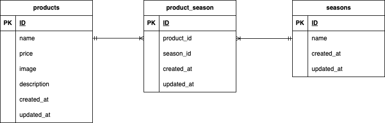

# mogitate(商品管理アプリ)

## 開発環境
**Dockerビルド**
1. `git clone git@github.com:TAKAHASHI-Saya/test_mogitate.git`
2. DockerDesktopアプリを立ち上げる
3. `docker-compose up -d --build`

**Laravel環境構築**
1. `docker-compose exec php bash`
2. `composer install`
3. `cp .env.example .env`
4. .envに以下の環境変数を追加
``` text
DB_CONNECTION=mysql
DB_HOST=mysql
DB_PORT=3306
DB_DATABASE=mogitate_db
DB_USERNAME=mogitate_user
DB_PASSWORD=mogitate_pass
```
5. アプリケーションキーの作成
``` bash
php artisan key:generate
```
6. マイグレーションの実行
``` bash
php artisan migrate
```
7. シーディングの実行
``` bash
php artisan db:seed
```
8. シンボリックリンクの実行（画像表示のため）
``` bash
php artisan storage:link
```

## 使用技術（実行環境）
- PHP 8.1.34
- Laravel Framework 8.83.29
- MySQL 8.0.26

## 画像について
本アプリでは、確認テスト用のダミーデータを表示するために、storage/app/public/fruits-img配下の画像をgit管理しています。
実運用では、git管理をしない想定です。

## ER図


## URL
- 商品一覧画面: http://localhost/products
- phpMyAdmin: http://localhost:8080/
